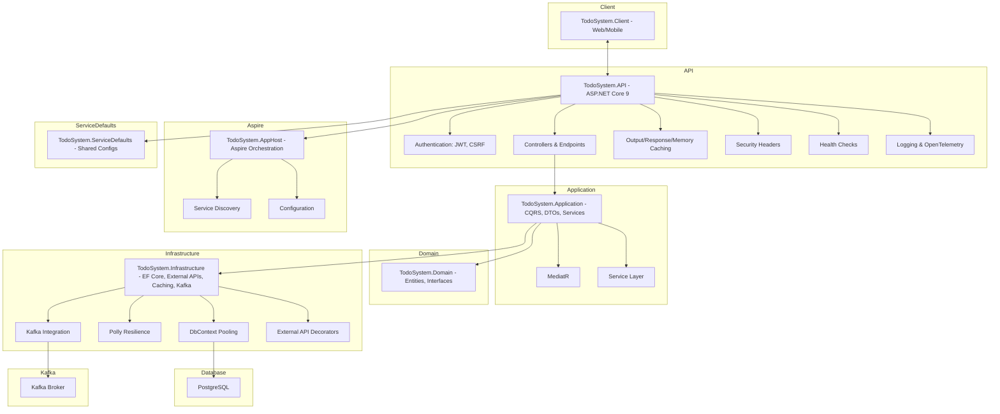

# Todo System Backend (.NET)

This is the .NET backend API for the Todo System application built with .NET 9. It provides comprehensive endpoints for managing todos, user authentication, external API integration, and includes advanced features like caching, security hardening, and comprehensive testing.

## Architecture Diagram


## Sequence Diagram

```mermaid
sequenceDiagram
    participant Client as TodoSystem.Client - Web/Mobile
    participant API as TodoSystem.API - ASP.NET Core 9
    participant Auth as Authentication - JWT, CSRF
    participant Controller as Controllers & Endpoints
    participant Cache as Output/Response/Memory Caching
    participant Security as Security Headers
    participant Health as Health Checks
    participant Logging as Logging & OpenTelemetry
    participant RateLimiter as Rate Limiting
    participant App as TodoSystem.Application - CQRS, DTOs, Services
    participant MediatR as MediatR
    participant ServiceLayer as Service Layer
    participant Domain as TodoSystem.Domain - Entities, Interfaces
    participant Infra as TodoSystem.Infrastructure - EF Core, External APIs, Caching, Kafka
    participant DbPool as DbContext Pooling
    participant Polly as Polly Resilience
    participant Kafka as Kafka Integration
    participant Decorator as External API Decorators
    participant Aspire as TodoSystem.AppHost - Aspire Orchestration
    participant ServiceDiscovery as Service Discovery
    participant Config as Configuration
    participant ServiceDefaults as TodoSystem.ServiceDefaults - Shared Configs
    participant Database as PostgreSQL
    participant KafkaBroker as Kafka Broker

    Client->>API: HTTP Request (e.g. GET /api/v1/todos)
    API->>Auth: Validate JWT & CSRF
    API->>RateLimiter: Check rate limits
    API->>Security: Apply security headers
    API->>Controller: Route to controller
    Controller->>Cache: Check cache
    alt Cache Hit
        Cache-->>Controller: Return cached response
    else Cache Miss
        Controller->>App: Call application layer
        App->>MediatR: Dispatch request
        MediatR->>ServiceLayer: Handle business logic
        ServiceLayer->>Domain: Validate entities
        ServiceLayer->>Infra: Data access or external API
        Infra->>DbPool: Use DbContext pooling
        Infra->>Polly: Apply resilience policies
        Infra->>Decorator: Use external API decorators
        Infra->>Kafka: Publish/consume events
        Infra->>Database: Query/update PostgreSQL
        Infra->>KafkaBroker: Send/receive Kafka messages
        Infra-->>ServiceLayer: Return data
        ServiceLayer-->>MediatR: Return result
        MediatR-->>App: Return result
        App-->>Controller: Return result
        Controller->>Cache: Store in cache
        Controller-->>API: Return response
    end
    API->>Health: Health check (if requested)
    API->>Logging: Log request/response
    API->>Aspire: Service orchestration (local dev)
    API->>ServiceDefaults: Use shared configs
    API-->>Client:HTTP Response
``` 


## Technology Stack

- ASP.NET Core 9.0 Web API
- Entity Framework Core with PostgreSQL
- JWT Bearer Authentication with Antiforgery protection
- Output Caching and Response Caching
- Memory Caching with cache invalidation strategies
- Polly for HTTP resilience patterns
- OWASP security headers for XSS/CSRF protection
- MediatR for CQRS pattern
- xUnit for comprehensive testing
- Aspire for local development orchestration

## Project Structure

```
backend/net/
├── TodoSystem.API/                    # Main Web API project
├── TodoSystem.API.Tests/              # API integration tests
├── TodoSystem.Application/            # Application layer (MediatR, DTOs, Services)
├── TodoSystem.Application.Tests/      # Application layer unit tests
├── TodoSystem.Domain/                 # Domain entities and interfaces
├── TodoSystem.Domain.Tests/           # Domain unit tests
├── TodoSystem.Infrastructure/         # Infrastructure (EF Core, External APIs, Caching)
├── TodoSystem.Infrastructure.Tests/   # Infrastructure unit tests
├── TodoSystem.AppHost/                # Aspire orchestration host
├── TodoSystem.ServiceDefaults/        # Shared service configurations
└── TodoSystem.sln                     # Solution file
```

## Recent Features & Enhancements

### Security Features
- **CSRF Protection**: Antiforgery tokens for all unsafe HTTP methods
- **XSS Prevention**: OWASP security headers and content security policies
- **Open Redirect Protection**: Safe redirect helper for authentication flows
- **CORS Configuration**: Properly configured for development and production

### Performance & Caching
- **Memory Caching**: Generic cache service with pattern-based invalidation
- **Output Caching**: ASP.NET Core 7+ output caching with multiple policies
- **Response Caching**: HTTP-level caching with proper headers
- **Service Layer Caching**: Decorator pattern for external API calls
- **Connection Pooling**: DbContext pooling for better performance

### Resilience & Reliability
- **HTTP Resilience**: Polly policies for retry, timeout, and circuit breaker
- **Health Checks**: Database and external service health monitoring
- **Comprehensive Logging**: OpenTelemetry integration
- **Error Handling**: Global exception handling middleware

## Getting Started

### Prerequisites

- .NET 9 SDK or later
- PostgreSQL 12+ or Azure Database for PostgreSQL
- Visual Studio 2022 17.8+, VS Code, or JetBrains Rider
- Docker (optional, for PostgreSQL)

### Setup Project and Solution

If you're recreating this solution from scratch, here are the commands used to build this architecture:

```bash
# Create solution
dotnet new sln -n TodoSystem

# Create main projects
dotnet new webapi -n TodoSystem.API
dotnet new classlib -n TodoSystem.Application
dotnet new classlib -n TodoSystem.Domain
dotnet new classlib -n TodoSystem.Infrastructure

# Create Aspire projects
dotnet new aspire-apphost -n TodoSystem.AppHost
dotnet new aspire-servicedefaults -n TodoSystem.ServiceDefaults

# Add projects to solution
dotnet sln add TodoSystem.API/TodoSystem.API.csproj
dotnet sln add TodoSystem.Application/TodoSystem.Application.csproj
dotnet sln add TodoSystem.Domain/TodoSystem.Domain.csproj
dotnet sln add TodoSystem.Infrastructure/TodoSystem.Infrastructure.csproj
dotnet sln add TodoSystem.AppHost/TodoSystem.AppHost.csproj
dotnet sln add TodoSystem.ServiceDefaults/TodoSystem.ServiceDefaults.csproj

# Create test projects
dotnet new xunit -n TodoSystem.API.Tests
dotnet new xunit -n TodoSystem.Application.Tests
dotnet new xunit -n TodoSystem.Domain.Tests
dotnet new xunit -n TodoSystem.Infrastructure.Tests

# Add test projects to solution
dotnet sln add TodoSystem.API.Tests/TodoSystem.API.Tests.csproj
dotnet sln add TodoSystem.Application.Tests/TodoSystem.Application.Tests.csproj
dotnet sln add TodoSystem.Domain.Tests/TodoSystem.Domain.Tests.csproj
dotnet sln add TodoSystem.Infrastructure.Tests/TodoSystem.Infrastructure.Tests.csproj

# Add project references
dotnet add TodoSystem.API/TodoSystem.API.csproj reference TodoSystem.Application/TodoSystem.Application.csproj
dotnet add TodoSystem.API/TodoSystem.API.csproj reference TodoSystem.Domain/TodoSystem.Domain.csproj
dotnet add TodoSystem.API/TodoSystem.API.csproj reference TodoSystem.Infrastructure/TodoSystem.Infrastructure.csproj
dotnet add TodoSystem.API/TodoSystem.API.csproj reference TodoSystem.ServiceDefaults/TodoSystem.ServiceDefaults.csproj

dotnet add TodoSystem.Application/TodoSystem.Application.csproj reference TodoSystem.Domain/TodoSystem.Domain.csproj
dotnet add TodoSystem.Infrastructure/TodoSystem.Infrastructure.csproj reference TodoSystem.Application/TodoSystem.Application.csproj
dotnet add TodoSystem.Infrastructure/TodoSystem.Infrastructure.csproj reference TodoSystem.Domain/TodoSystem.Domain.csproj

# Add Aspire project references
dotnet add TodoSystem.AppHost/TodoSystem.AppHost.csproj reference TodoSystem.API/TodoSystem.API.csproj

# Add test project references
dotnet add TodoSystem.API.Tests/TodoSystem.API.Tests.csproj reference TodoSystem.API/TodoSystem.API.csproj
dotnet add TodoSystem.Application.Tests/TodoSystem.Application.Tests.csproj reference TodoSystem.Application/TodoSystem.Application.csproj
dotnet add TodoSystem.Domain.Tests/TodoSystem.Domain.Tests.csproj reference TodoSystem.Domain/TodoSystem.Domain.csproj
dotnet add TodoSystem.Infrastructure.Tests/TodoSystem.Infrastructure.Tests.csproj reference TodoSystem.Infrastructure/TodoSystem.Infrastructure.csproj

# add kafka
# Add to TodoSystem.API
dotnet add TodoSystem.API package Confluent.Kafka --version 2.3.0
dotnet add TodoSystem.API package Microsoft.Extensions.Hosting --version 8.0.0

# Add to TodoSystem.Infrastructure  
dotnet add TodoSystem.Infrastructure package Confluent.Kafka --version 2.3.0

# Add to TodoSystem.Application
dotnet add TodoSystem.Application package Confluent.Kafka --version 2.3.0
```

### Quick Setup with Aspire

1. Clone the repository:
   ```bash
   git clone https://github.com/your-org/todo-system.git
   cd todo-system/backend/net
   ```

2. Restore dependencies:
   ```bash
   dotnet restore
   ```

3. Run with Aspire orchestration:
   ```bash
   dotnet run --project TodoSystem.AppHost
   ```

This will start the entire application stack including the API and any required services.

### Manual Setup

1. **Database Setup** - Start PostgreSQL (Docker example):
   ```bash
   docker run --name todo-postgres -e POSTGRES_PASSWORD=postgres -e POSTGRES_DB=todosystem -p 5432:5432 -d postgres:15
   ```

2. **Configure Connection String** via User Secrets:
   ```bash
   dotnet user-secrets set "ConnectionStrings:DefaultConnection" "Host=localhost;Database=todosystem;Username=postgres;Password=postgres" --project TodoSystem.API
   ```

3. **Configure JWT Settings** via User Secrets:
   ```bash
   dotnet user-secrets set "Jwt:Key" "your-super-secret-key-here-make-it-long-enough-for-security" --project TodoSystem.API
   dotnet user-secrets set "Jwt:Issuer" "TodoSystem.API" --project TodoSystem.API
   dotnet user-secrets set "Jwt:Audience" "TodoSystem.Client" --project TodoSystem.API
   ```

4. **Apply Database Migrations**:
   ```bash
   dotnet ef migrations add InitialCreate --project TodoSystem.Infrastructure --startup-project TodoSystem.API
   dotnet ef database update --project TodoSystem.Infrastructure --startup-project TodoSystem.API
   ```

5. **Run the Application**:
   ```bash
   dotnet run --project TodoSystem.API --launch-profile https
   ```

## Running the API with HTTPS

To ensure your API uses HTTPS (recommended for development and required for production), use the `https` launch profile:

```sh
dotnet run --project TodoSystem.API --launch-profile https
```

This will start the API on:

- https://localhost:7148
- http://localhost:5260

You can now make secure requests to `https://localhost:7148`.

If you use Visual Studio or VS Code, select the `https` profile when launching the project.

> **Tip:** If you see a browser warning about the development certificate, you can trust the .NET dev certificate by running:
> ```sh
> dotnet dev-certs https --trust
> ```

## API Endpoints

### Authentication & Authorization
- `POST /api/v1/auth/register` - Register a new user
- `POST /api/v1/auth/login` - Authenticate user and get JWT token

### Todo Management (Protected)
- `GET /api/v1/todos` - Get all todos for authenticated user (cached)
- `GET /api/v1/todos/{id}` - Get a specific todo
- `POST /api/v1/todos` - Create a new todo (requires CSRF token)
- `PUT /api/v1/todos/{id}` - Update an existing todo (requires CSRF token)
- `DELETE /api/v1/todos/{id}` - Delete a todo (requires CSRF token)

### External Todo Integration (Protected)
- `GET /api/v1/externaltodos` - Get todos from external service (cached)
- `GET /api/v1/externaltodos/{id}` - Get specific external todo (cached)
- `POST /api/v1/externaltodos` - Create external todo
- `PUT /api/v1/externaltodos/{id}` - Update external todo
- `DELETE /api/v1/externaltodos/{id}` - Delete external todo

### System Health
- `GET /health` - Health check endpoint (cached)

## Security & Authentication

### JWT Bearer Authentication
Include the JWT token in the Authorization header:
```
Authorization: Bearer {your-jwt-token}
```

### CSRF Protection
For unsafe methods (POST, PUT, DELETE), include the antiforgery token:
1. Get the XSRF token from the cookie (automatically set on GET requests)
2. Include it in the `X-XSRF-TOKEN` header

### CORS Configuration
The API is configured to accept requests from specific origins in development. Update the CORS policy in `Program.cs` for production.

## Development

### Adding Database Migrations

```bash
dotnet ef migrations add MigrationName --project TodoSystem.Infrastructure --startup-project TodoSystem.API
dotnet ef database update --project TodoSystem.Infrastructure --startup-project TodoSystem.API
```

### Running Tests

```bash
# Run all tests
dotnet test

# Run specific test project
dotnet test TodoSystem.API.Tests
dotnet test TodoSystem.Application.Tests
dotnet test TodoSystem.Infrastructure.Tests
dotnet test TodoSystem.Domain.Tests

# Run with coverage
dotnet test --collect:"XPlat Code Coverage"
```

### Code Quality & Conventions

- Follow Microsoft's .NET coding conventions
- Use async/await for all I/O operations
- Implement CQRS pattern with MediatR
- Use repository pattern for data access
- Comprehensive error handling and validation
- Proper logging with structured logging

## Performance Features

### Caching Policies
- **External Todos**: 30-second TTL with query parameter variation
- **User Todos**: 60-second TTL with user-specific variation
- **Public Data**: 5-minute TTL for general data
- **Health Checks**: 10-second TTL for system status

### Connection Management
- DbContext connection pooling (128 connections)
- HTTP client connection pooling with proper lifetime management
- Automatic compression (Brotli/Gzip)

## Deployment

### Azure App Service

1. Create Azure resources:
   ```bash
   az group create --name TodoSystemGroup --location eastus
   az appservice plan create --name TodoSystemPlan --resource-group TodoSystemGroup --sku B1
   az webapp create --name TodoSystemAPI --resource-group TodoSystemGroup --plan TodoSystemPlan --runtime "DOTNETCORE|9.0"
   ```

2. Deploy the application:
   ```bash
   dotnet publish -c Release -o ./publish
   cd publish
   zip -r ../deploy.zip .
   az webapp deploy --resource-group TodoSystemGroup --name TodoSystemAPI --src-path ../deploy.zip
   ```

### Environment Configuration

Set these environment variables for production:
- `ConnectionStrings__DefaultConnection`: PostgreSQL connection string
- `Jwt__Key`: Strong JWT signing key (minimum 32 characters)
- `Jwt__Issuer`: Your API issuer identifier
- `Jwt__Audience`: Your client audience identifier
- `ASPNETCORE_ENVIRONMENT`: Set to "Production"

## Monitoring & Observability

- **Health Checks**: Available at `/health` endpoint
- **Structured Logging**: Using Serilog with JSON formatting
- **OpenTelemetry**: Integrated for distributed tracing
- **Cache Statistics**: Memory cache hit/miss metrics available

## Configure Development SSL Certificates
```bash
# Trust the .NET development certificate
dotnet dev-certs https --clean
dotnet dev-certs https --trust
```

## License

[MIT](../../LICENSE)
